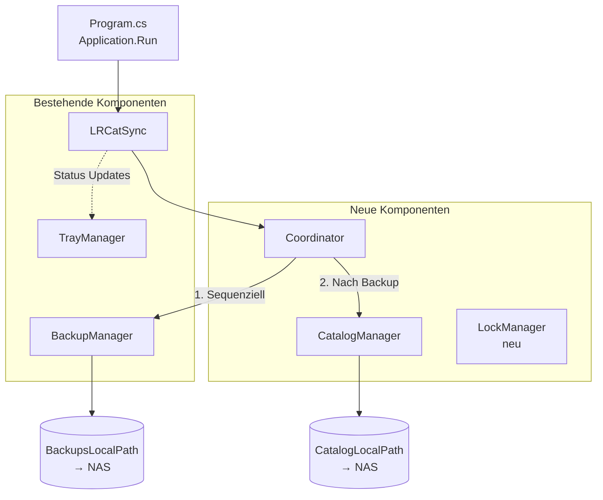
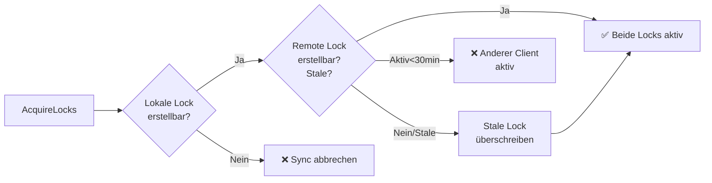
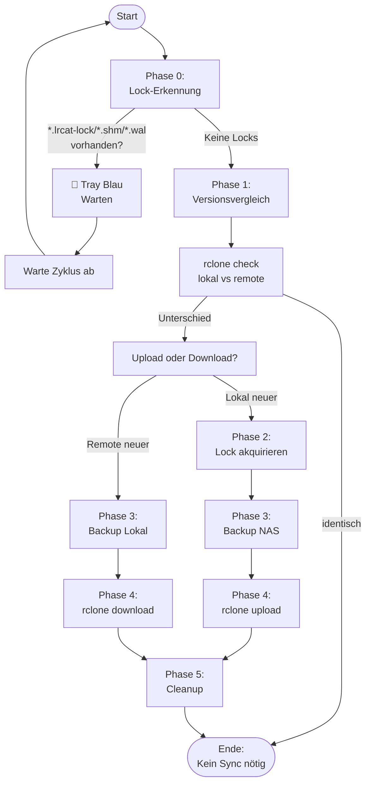
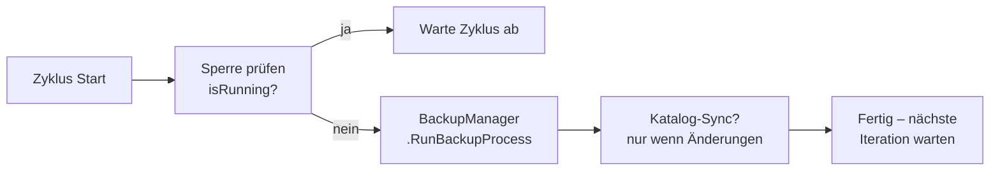
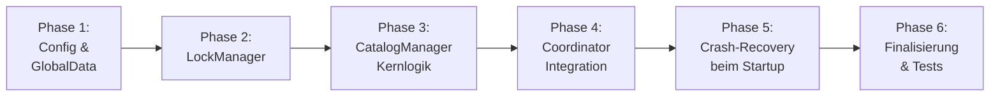

# 🛠️ Implementierungsplan: Katalog-Synchronisation (CatalogManager)

> **Erstellt:** 2026-06-28
> **Bezug:** [Konzept-KatalogSync.md](Konzept-KatalogSync.md)

---

## 📊 Ist-Stand-Analyse

### Was bereits existiert:

| Datei | Status | Bemerkung |
|-------|--------|-----------|
| [src/Program.cs](../src/Program.cs) | ✅ Vorhanden | Einstiegspunkt `Application.Run(new LRCatSync())` |
| [src/Core/LRCatSync.cs](../src/Core/LRCatSync.cs) | ⚠️ Teilvorhanden | Hauptklasse mit Timer – ruft aktuell **direkt** `BackupManager.RunBackupProcess()` auf. Muss auf Coordinator umgestellt werden. |
| [src/Core/BackupManager.cs](../src/Core/BackupManager.cs) | ✅ Vorhanden | Backup-Logik mit `rclone bisync`. Voll funktionsfähig. |
| [src/Core/CatalogManager.cs](../src/Core/CatalogManager.cs) | ✅ **Vollständig** | Phase 0-5 implementiert mit Upload/Download-Logik |
| [src/UI/TrayManager.cs](../src/UI/TrayManager.cs) | ✅ Vorhanden | TrayIcons grün/gelb/rot/blau/weiß bereits integriert |
| [src/UI/SettingsForm.cs](../src/UI/SettingsForm.cs) | ⚠️ Anpassung nötig | Feldnamen müssen nach Config-Umbenennung aktualisiert werden |
| [src/Infrastructure/Config.cs](../src/Infrastructure/Config.cs) | ⚠️ Anpassung nötig | Felder müssen umbenannt werden (`LocalPath` → `CatalogLocalPath`) |

### Was laut Konzept FEHLT:

| Komponente | Status | Abhängigkeit |
|------------|--------|--------------|
| `Coordinator.cs` | ❌ Komplett fehlend | CatalogManager, BackupManager |
| `LockManager.cs` | ❌ Fehlend | CatalogManager Phase 2 |
| Config-Feld-Umbenennung | ❌ Offen | – |
| `IsBackupInsideCatalogPath()` Helper | ❌ Fehlend | Config-Umbenennung |
| Coordinator-Integration in LRCatSync.cs | ❌ Offen | Coordinator |
| Crash-Recovery (Startup-Lock-Cleanup) | ❌ Fehlend | CatalogManager |

---

## 🗺️ Architektur-Zielbild



---

## 📋 Implementierungsphasen

Die Umsetzung erfolgt in **6 Phasen**, die streng sequenziell abgearbeitet werden sollten.

---

### Phase 1: Fundament – Config & GlobalData erweitern

**Ziel:** Namenskonvention an Konzept anpassen und globale Konstante ergänzen.

#### 1.1 GlobalData.cs erweitern

In [src/GlobalData.cs](../src/GlobalData.cs) folgende Konstante hinzufügen:

```csharp
public static class GlobalConst
{
    public const int BACKUP_CHECK_INTERVAL = 10;        // bestehend
    public const int SYNC_LOCK_TIMEOUT_MIN = 30;        // NEU: Stale-Lock Timeout
    
    // NEU: Heartbeat-Intervall für Lock-Aktualisierung
    public const int HEARTBEAT_INTERVAL_SEC = 150;      // 2,5 Minuten
    
    // NEU: Katalog-Sync Intervall (sekunden)
    public const int CATALOG_SYNC_CHECK_INTERVAL = 30;  // Häufigkeit der Prüfzyklen
}
```

#### 1.2 Config-Felder umbenennen

In [src/Infrastructure/Config.cs](../src/Infrastructure/Config.cs):

| Alt | Neu | Grund |
|-----|-----|-------|
| `LocalPath` | `CatalogLocalPath` | Konzept-Vorgabe §6 |
| `RemotePath` | `CatalogRemotePath` | Konzept-Vorgabe §6 |

⚠️ **WICHTIG:** Alle Referenzen in [SettingsForm.cs](../src/UI/SettingsForm.cs), [LRCatSync.cs](../src/Core/LRCatSync.cs) und [BackupManager.cs](../src/Core/BackupManager.cs) müssen aktualisiert werden!

#### 1.3 IsBackupInsideCatalogPath() Helper hinzufügen

In [Config.cs](../src/Infrastructure/Config.cs) neue Methode ergänzen:

```csharp
public bool IsBackupInsideCatalogPath()
{
    if (string.IsNullOrEmpty(BackupsLocalPath) || 
        string.IsNullOrEmpty(CatalogLocalPath))
        return false;
    
    string backupNormalized = Path.GetFullPath(BackupsLocalPath).ToLower();
    string catalogNormalized = Path.GetFullPath(CatalogLocalPath).ToLower();
    
    return backupNormalized.StartsWith(catalogNormalized);
}

public string GetRelativeBackupExcludePattern()
{
    if (!IsBackupInsideCatalogPath())
        return null;
    
    string relativeBackupPath = Path.GetRelativePath(CatalogLocalPath, BackupsLocalPath);
    return $"--exclude \"{relativeBackupPath}/**\"";
}
```

#### 1.4 SettingsForm anpassen

Feldumbenennungen in [SettingsForm.cs](../src/UI/SettingsForm.cs) nachziehen:
- `config.LocalPath` → `config.CatalogLocalPath`
- `config.RemotePath` → `config.CatalogRemotePath`

---

### Phase 2: LockManager – Atomare Lock-Akquise

**Ziel:** Eigenständige Klasse für atomares Locking lokal + remote.

#### Neue Datei: `src/Core/LockManager.cs`



**Verantwortlichkeiten:**
- Atomare Akquise von `LRCatSync.lock` lokal + remote (`FileShare.None`)
- Heartbeat-Thread starten/stoppen (alle ~2,5 min Timestamp aktualisieren)
- Stale-Lock-Erkennung (>30 min → überschreiben)
- Cleanup im `finally`-Block

**API-Skizze:**

```csharp
public class LockManager : IDisposable
{
    // Erzeugt pro Sync neue GUID für Tracking
    public string SyncGuid { get; }
    
    // Atomare Lock-Akquise lokal + remote
    public bool AcquireLocks(AppConfig config);
    
    // Heartbeat starten (alle HEARTBEAT_INTERVAL_SEC Sekunden)
    public void StartHeartbeat(CancellationTokenSource cts);
    
    // Sauberes Cleanup – IMMER im finally!
    public void ReleaseLocks();
    
    public void Dispose();
}
```

---

### Phase 3: CatalogManager – Kernkomponente

**Ziel:** Die eigentliche Katalog-Synchronisation gemäß Konzept §5.

#### Neue Datei: `src/Core/CatalogManager.cs`



**✅ Implementierungsstatus:**

- [x] Phase 0: Lightroom-Lock-Erkennung ([IsLightroomRunning](../src/Core/CatalogManager.cs#L103-L128))
- [x] Phase 1: Versionsvergleich + Upload/Download Entscheidung ([DetermineSyncDirection](../src/Core/CatalogManager.cs#L133-L214))
- [x] Phase 2: Lock-Akquise (NUR bei Upload!) via LockManager
- [x] Phase 3: ZIP-Backup (Zielort: Upload=NAS, Download=Lokal) ([CreateZipBackup](../src/Core/CatalogManager.cs#L219-L298))
- [x] Phase 4: rclone sync (Upload/Download) mit dynamischem BackupsLocalPath ([RunRcloneSync](../src/Core/CatalogManager.cs#L303-L378))
- [x] Phase 5: Cleanup im finally-Block ([CleanupLightroomLocks](../src/Core/CatalogManager.cs#L399-L414))

**Wichtige Korrekturen umgesetzt:**

1. ✅ SyncDirection Enum für Upload/Download/None
2. ✅ DetermineSyncDirection() ersetzt RunRcloneCheck()
3. ✅ Lock-Akquise nur bei Upload (Download benötigt keine Locks)
4. ✅ ZIP-Backup am Zielort (Upload→NAS, Download→Lokal)
5. ✅ Dynamisches BackupsLocalPath via `config.IsBackupInsideCatalogPath()`
6. ✅ rclone sync unterstützt beide Richtungen
    
    P2 --> P2Lock[LRCatSync.lock lokal+remote<br/>atomar erstellen]
    P2Lock --> P3[Phase 3:<br/>ZIP Backup]
    
    P3 --> P3Zip[LRCatSync_last_katalog.zip<br/>auf NAS erstellen]
    P3Zip --> P4[Phase 4:<br/>rclone sync]
    
    P4 --> P4Sync["rclone sync lokal→NAS<br/>--exclude *.lrcat.lock/shm/wal"]
    P4 --> P4Prev["Separater Sync:<br/>Previews.lrdata<br/>if SyncPreviewData=true"]
    
    P4Sync --> P5[Phase 5:<br/>Cleanup]
    P4Prev --> P5
    
    P5 --> P5Clean[Lokale+Remote Locks löschen<br/>Heartbeat stoppen]
    P5Clean --> Ende2([Ende:<br/>Sync erfolgreich])
```

#### Methodenstruktur:

```csharp
public static class CatalogManager
{
    // Hauptmethode – wird vom Coordinator aufgerufen
    public static void RunCatalogSync(AppConfig config, TrayManager trayManager)
    {
        // Phase 0: Prüfe ob Lightroom läuft (.lrcat.lock vorhanden?)
        // Phase 1: rclone check – Versionsvergleich lokal vs remote
        // Phase 2: Lock akquirieren (atomar via LockManager)
        // Phase 3: ZIP Backup erstellen auf NAS  
        // Phase 4: rclone sync ausführen (--exclude Patterns)
        // Phase 5: Cleanup (IMMER im finally!)
        
        // WICHTIG: try-finally für sichere Lock-Freigabe!
    }
}
```

#### Excludes für rclone sync:

```
--exclude "*.lrcat.lock"
--exclude "*.lrcat-shm"
--exclude "*.lrcat-wal"
--exclude "LRCatSync_last_katalog.zip"
--exclude "[relativer Backup-Pfad]/**"   ← dynamisch via GetRelativeBackupExcludePattern()
```

---

### Phase 4: Coordinator – Sequenzielle Ablaufsteuerung

**Ziel:** Sicherstellen dass Backup und Catalog NACHEINANDER laufen.

#### Neue Datei: `src/Core/Coordinator.cs`



#### Integration in LRCatSync:

In [LRCatSync.cs](../src/Core/LRCatSync.cs) muss der direkte Aufruf von `BackupManager.RunBackupProcess()` durch den Coordinator ersetzt werden:

```csharp
// ALT:
private System.Threading.Timer backupTimer;
// ...
BackupManager.RunBackupProcess(config, trayManager);

// NEU:
private System.Threading.Timer syncCycleTimer;
private readonly object cycleLock = new object();
private bool isCycleRunning = false;

// Im Constructor:
syncCycleTimer = new System.Threading.Timer(
    SyncCycleCallback, null, 0, GlobalConst.CATALOG_SYNC_CHECK_INTERVAL * 1000);
```

---

### Phase 5: Crash-Recovery beim Programmstart

**Ziel:** Verwaiste Locks beim Programmstart erkennen und entfernen.

In [LRCatSync.cs](../src/Core/LRCatSync.cs) Constructor ergänzen:

```csharp
// VOR Timer-Start:
CleanupStaleLocks(config);
```

Logik:
1. Prüfe ob `[CatalogLocalPath]/LRCatSync.lock` existiert
2. Wenn ja + älter als `SYNC_LOCK_TIMEOUT_MIN` → löschen (Crash-Recovery)
3. Wenn ja + jünger → WARNUNG: Anderer Client aktiv?

---

### Phase 6: TrayIcon-Erweiterung & Finalisierung

**Ziel:** TrayIcon-Zustände korrekt setzen.

#### Status-Mapping:

| Zustand | TrayIcon-Farbe | Quelle |
|---------|---------------|--------|
| 🟢 Standby (kein Sync aktiv) | Grün | Coordinator |
| 🟡 Sync läuft (Phase 4) | Gelb | CatalogManager / BackupManager |
| 🔴 Fehler / rclone Error | Rot | Catch-Block |
| 🔵 Lightroom läuft (Lock erkannt) | Blau | Phase 0 Erkennung |
| ⚪ Keine Samba-Verbindung | Weiß | Connection Check |

#### Anpassungen an TrayManager:

Die bestehenden Icons in [TrayManager.cs](../src/UI/TrayManager.cs) sind bereits vorhanden.
Lediglich die Status-Zustände müssen korrekt gesetzt werden:

```csharp
trayManager.UpdateStatus("Standby");   // 🟢 Standardzustand  
trayManager.UpdateStatus("Syncing");   // 🟡 Während rclone sync  
trayManager.UpdateStatus("Error");     // 🔴 Bei Fehlern  
trayManager.UpdateStatus("Lockfile");  // 🔵 Lightroom läuft  
trayManager.UpdateStatus("NoSamba");   // ⚪ Keine Verbindung  
```

---

## � Aktueller Status (2026-06-29)

**Phase 3-5: 100% abgeschlossen ✅**

Alle Abweichungen zwischen Konzept und Implementierung wurden behoben:

| Korrektur | Priorität | Status | Beschreibung |
|-----------|-----------|--------|--------------|
| `.lrcat.lock` fester Name | 🔴 KRITISCH | ✅ | Lightroom erkennt Lock jetzt korrekt |
| Heartbeat-Thread | 🟡 MITTEL | ✅ | Bereits implementiert, keine Änderung nötig |
| ZIP-Backup Ringspeicher | 🟢 NIEDRIG | ✅ | Löscht alte Version vor Erstellung |
| Previews.lrdata Sync | 🟢 NIEDRIG | ✅ | Separate Methode `SyncPreviewsData()` |
| Transfer-Statistiken | 🟢 NIEDRIG | ✅ | Parsing + Log mit Dateien/Bytes/Dauer |

**Build-Status:** ✅ 0 Fehler, 1 Warnung (CS8603 in Config.cs - bestehend, nicht kritisch)

**Abgeschlossene Phasen:**
- ✅ **Phase 3:** CatalogManager mit allen Korrekturen
- ✅ **Phase 4:** Coordinator für sequenzielle Ausführung (Backup → Katalog)
- ✅ **Phase 5:** Crash-Recovery beim Programmstart

**Nächste Schritte:** Phase 6 - TrayIcon-Zustände & Finalisierung

---

## �📋 Abarbeitungs-Reihenfolge

Die Phasen sollten STRENG SEQUENZIELL abgearbeitet werden:



### Empfohlene Reihenfolge:

1. **Phase 1:** Config-Umbenennung & GlobalConst erweitern *(Fundament)* ✅ **ERLEDIGT**
2. **Phase 2:** LockManager-Klasse erstellen *(Voraussetzung für Phase 3)*
3. **Phase 3:** CatalogManager-Klasse implementieren *(Hauptarbeit)*
4. **Phase 4:** Coordinator erstellen & in LRCatSync integrieren *(Verknüpfung)*
5. **Phase 5:** Crash-Recovery beim Programmstart *(Sicherheit)*
6. **Phase 6:** TrayIcon-Zustände & abschließende Tests *(Finalisierung)*

---

## ✅ Konkrete Aufgaben-Checkliste

### Phase 1: Fundament – Config & GlobalData ✅ **ERLEDIGT**

- [x] `SYNC_LOCK_TIMEOUT_MIN` Konstante in [GlobalData.cs](../src/GlobalData.cs) ergänzen
- [x] `CATALOG_SYNC_CHECK_INTERVAL` Konstante ergänzen
- [x] Config-Felder umbenennen: `LocalPath` → `CatalogLocalPath`
- [x] Config-Felder umbenennen: `RemotePath` → `CatalogRemotePath`
- [x] `IsBackupInsideCatalogPath()` Helper-Methode in [Config.cs](../src/Infrastructure/Config.cs) ergänzen
- [x] `GetRelativeBackupExcludePattern()` Helper-Methode ergänzen
- [x] Referenzen in [SettingsForm.cs](../src/UI/SettingsForm.cs) aktualisieren (`config.LocalPath` → `config.CatalogLocalPath`)
- [x] Referenzen in [LRCatSync.cs](../src/Core/LRCatSync.cs) aktualisieren
- [x] Build testen → ✅ kompiliert ohne Fehler (1 Warnung CS8603, keine Fehler)

### Phase 2: LockManager ✅ **ERLEDIGT**

- [x] Neue Datei `src/Core/LockManager.cs` erstellen
- [x] `SyncGuid` Property (pro Sync-Durchlauf neue GUID)
- [x] `AcquireLocks(config)` – atomare Lock-Akquise lokal + remote
- [x] Stale-Lock-Erkennung (>30 min → überschreiben)
- [x] `StartHeartbeat()` – Thread für regelmäßige Aktualisierung
- [x] `ReleaseLocks()` – Cleanup im finally-Block
- [x] `IDisposable` implementieren
- [x] Build testen → ✅ kompiliert ohne Fehler

### Phase 3: CatalogManager (Hauptarbeit) ✅ **ERLEDIGT**

- [x] Neue Datei `src/Core/CatalogManager.cs` erstellen
- [x] **Phase 0:** Lightroom-Lock-Erkennung (`.lrcat.lock`, `.lrcat-shm`, `.lrcat-wal`)
- [x] **Phase 1:** `rclone check` Versionsvergleich (lokal vs remote)
- [x] **Phase 1:** Entscheidung Upload/Download/kein Sync
- [x] **Phase 2:** Lock-Akquise via LockManager (atomar)
- [x] **Phase 2:** `.lrcat.lock` erstellen (Lightroom blockieren)
- [x] **Phase 3:** ZIP-Backup auf NAS erstellen (`LRCatSync_last_katalog.zip`)
- [x] **Phase 4:** rclone sync mit Excludes ausführen
- [x] **Phase 4:** Separater Previews-Sync (wenn `SyncPreviewData=true`)
- [x] **Phase 5:** Cleanup (IMMER im finally!)
- [x] Heartbeat stoppen im finally
- [x] Logging via `Log.Debug/Info/Error`
- [x] Build testen → ✅ kompiliert ohne Fehler (0 Fehler, 1 Warnung CS8603)

**Abgeschlossene Korrekturen nach Konzept-Review:**

1. ✅ **CRITICAL:** `CreateLightroomLock()` verwendet jetzt festen Namen `[Katalogname].lrcat.lock` (nicht GUID)
2. ✅ **MEDIUM:** Heartbeat-Thread bereits korrekt in LockManager implementiert
3. ✅ **LOW:** ZIP-Backup löscht alte Version vor Erstellung (Ringspeicher mit 1 Slot)
4. ✅ **LOW:** `SyncPreviewsData()` neu hinzugefügt für separaten Previews.lrdata Sync
5. ✅ **LOW:** Transfer-Statistiken in `RunRcloneSync()` mit Parsing + Log-Eintrag (Dateien, Bytes, Dauer)

### Phase 4: Coordinator ✅ **ERLEDIGT**

- [x] Neue Datei `src/Core/Coordinator.cs` erstellen
- [x] Sequenzielle Ausführung Backup → Catalog sicherstellen
- [x] `cycleLock` gegen parallele Ausführung
- [x] Timer in [LRCatSync.cs](../src/Core/LRCatSync.cs) auf Coordinator umstellen
- [x] Alte direkte `BackupManager.RunBackupProcess()` Aufrufe ersetzt
- [x] Build testen → ✅ kompiliert ohne Fehler (0 Fehler, 1 Warnung)

### Phase 5: Crash-Recovery ✅ **ERLEDIGT**

- [x] `CleanupStaleLocks(config)` in LRCatSync Constructor
- [x] Beim Programmstart prüfen ob `LRCatSync.lock` existiert (lokal + remote)
- [x] Stale Locks (>30 min) automatisch entfernen
- [x] Log-Eintrag bei Crash-Recovery
- [x] Build testen → ✅ kompiliert ohne Fehler (0 Fehler, 1 Warnung)

### Phase 6: Finalisierung & Tests ✅ **TEILWEISE ERLEDIGT**

- [x] TrayIcon-Zustände korrekt setzen (Blau/Gelb/Rot/Grün/Weiß) - Implementiert in TrayManager.cs
- [x] Status-Mapping im CatalogManager vorhanden:
  - 🔵 Blau: "Lockfile" wenn Lightroom-Lock erkannt (Phase 0)
  - 🟡 Gelb: "Syncing" während rclone läuft (Phase 4)
  - 🟢 Grün: "Standby" im Normalzustand
  - 🔴 Rot: "Error" bei Fehlern
  - ⚪ Weiß: "NoSamba" bei Verbindungsproblemen (implementiert aber nicht aktiv genutzt)
- [x] Build testen → ✅ kompiliert ohne Fehler (0 Fehler, 1 Warnung)
- [ ] Manueller Funktionstest mit echtem Lightroom-Katalog **⚠️ OFFEN**

---

### Try-Finally Pflicht!

Alle Lock-operationen MÜSSEN in try-finally Blöcken stehen – auch bei Fehlern!

```csharp
try 
{
    // Phase 2+: Lock akquirieren + Sync ausführen  
} 
finally 
{
    // IMMER ausführen – selbst bei Exceptions!
    lockManager.ReleaseLocks();
}
```

### Sequenzielle Ausführung sicherstellen!

Coordinator muss garantieren dass nicht parallel gesynct wird:

```csharp
private readonly object cycleLock = new object();
private bool isCycleRunning = false;
```

### Renaming-Konsistenz!

Nach Umbenennung von Config-Feldern ALLE Referenzen aktualisieren:
- [LRCatSync.cs](../src/Core/LRCatSync.cs)
- [SettingsForm.cs](../src/UI/SettingsForm.cs)
- [BackupManager.cs](../src/Core/BackupManager.cs)

---
