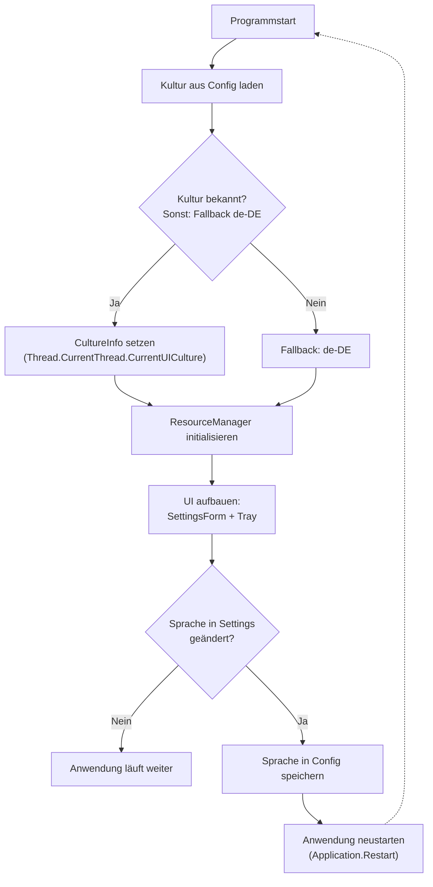

# Konzept: Mehrsprachigkeit für LRCatalogSync

> **Entscheidungen (Stand 2026-06-28)**
>
> - Unterstützte Sprachen: **Deutsch (de-DE)** als Standard + **Englisch (en-US)**
> - Die Architektur ist offen für weitere Sprachen (z.B. Französisch, Spanisch) – einfach neue RESX-Dateien hinzufügen.
> - Sprachwechsel erfolgt per **Neustart** der Anwendung (kein dynamisches Umschalten zur Laufzeit).
> - Logging bleibt weiterhin auf **Deutsch** (keine Lokalisierung der Log-Nachrichten).

---

## Architektur-Übersicht



**Alternativ als kompakte Text-Darstellung (falls Mermaid nicht gerendert wird):**

```
[Programmstart]
       ↓
[Kultur aus Config laden]
       ↓
<Kultur bekannt?> ── Nein → [Fallback: de-DE] ↘
       ↓                                          \
       Ja                                         /
       ↓                                        ↙
[CultureInfo setzen]                         ─→ ⤓
       ↓                                        ↓
[ResourceManager initialisieren] ◄───────────────┘
       ↓
[Alle UI-Strings über ResourceManager laden]
       ↓
[UI aufbauen: SettingsForm + Tray]
       ↓
<Sprache in Settings geändert?>
   ├── Nein → [Anwendung läuft weiter] → (bleibt im Betrieb)
   └── Ja → [Sprache in Config speichern]
                      ↓
                [Anwendung neustarten]
                      ↓
                  zurück zum Start
```

---
                    ┌─────────────┐
                    │ Programmstart│
                    └──────┬──────┘
                           ▼
                ┌────────────────────┐
                │ Kultur aus Config   │
                │     laden           │
                └──────────┬─────────┘
                           ▼
                    ┌──────┴──────┐
                    │ Kultur      │
                    │ bekannt?    │
                    └──────┬──────┘
                   ┌───────┴───────┐
                   │ Ja            │ Nein
                   ▼               ▼
          ┌─────────────┐  ┌─────────────────┐
          │ CultureInfo  │  │ Fallback: de-DE │
          │ setzen       │  └─────────────────┘
          └──────┬───────┘
                 ▼
        ┌─────────────────┐
        │ ResourceManager  │
        │ initialisieren   │
        └────────┬─────────┘
                 ▼
    ┌──────────────────────────┐
    │ Alle UI-Strings über      │
    │ ResourceManager laden     │
    └────────────┬──────────────┘
                 ▼
        ┌─────────────────┐
        │ UI aufbauen:     │◄────────────────┐
        │ SettingsForm +   │                 │
        │ Tray             │                 │
        └────────┬─────────┘                 │
                 ▼                           │
         ┌──────┴──────┐                    │
         │ Sprache in   │                    │
         │ Settings     │                    │
         │ geändert?    │                    │
         └──────┬──────┘                    │
           ┌────┴────┐                       │
           │ Nein    │ Ja                    │
           ▼         ▼                       │
    ┌──────────┐  ┌───────────────────┐     │
    │Anwendung │  │ Sprache in Config  │     │
    │läuft     │  │ speichern          │     │
    │weiter    │  └─────────┬─────────┘     │
    └────▲─────┘            ▼                │
         │          ┌─────────────────┐      │
         │          │ Anwendung       │      │
         └──────────│ neustarten      ├──────┘
                    └─────────────────┘
```

**Alternativ als kompakte Text-Darstellung (falls das Diagramm oben nicht korrekt angezeigt wird):**

```
[Programmstart]
       ↓
[Kultur aus Config laden]
       ↓
   <Kultur bekannt?>
   ├── Ja → [CultureInfo setzen] → [ResourceManager initialisieren]
   └── Nein → [Fallback: de-DE] → [ResourceManager initialisieren]
       ↓
[Alle UI-Strings über ResourceManager laden]
       ↓
[UI aufbauen: SettingsForm + Tray]
       ↓
<Sprache in Settings geändert?>
   ├── Nein → [Anwendung läuft weiter] → (bleibt im Betrieb)
   └── Ja → [Sprache in Config speichern] → [Anwendung neustarten] → zurück zum Start

---

## Schritt-für-Schritt Anleitung

### Schritt 1: Vorbereitung – String-Inventur erstellen

**Ziel:** Alle hartcodierten Texte sammeln, bevor sie ersetzt werden.

1. Eine Tabelle mit drei Spalten anlegen: `Key`, `Deutsch (de-DE)`, `Englisch (en-US)`
2. Folgende Dateien durchgehen und jeden sichtbaren Text erfassen:
   - `src/UI/SettingsForm.cs` – Fenster-Titel, Labels, Button-Texte, MessageBox-Meldungen
   - `src/Core/LRCatSync.cs` – Tray-Menü-Einträge ("Einstellungen", "Beenden")
   - `src/UI/TrayManager.cs` – Status-Texte ("Standby", "Syncing", "Error", ...)
3. Pro Eintrag einen eindeutigen Key festlegen (z.B. `btn_save`, `menu_exit`, `status_standby`)
4. Die Tabelle wird in Schritt 3 als Vorlage für die RESX-Dateien verwendet

**Ergebnis:** Vollständige Liste aller zu lokalisierenden Strings mit Keys.

---

### Schritt 2: RESX-Dateien erstellen

**Ziel:** Zentrale Ressourcendateien für alle UI-Texte anlegen.

1. Neuen Ordner `src/Infrastructure/Localization/Resources/` erstellen
2. Datei `Strings.resx` anlegen – dies ist die **Fallback-Datei** (Deutsch als Standard)
3. Datei `Strings.en.resx` anlegen – dies ist die **englische Übersetzung**
4. In beiden Dateien dieselben Keys verwenden (z.B. `btn_save` → "Speichern" / "Save")
5. Die Reihenfolge der Keys in beiden Dateien identisch halten, damit sie leicht vergleichbar bleiben
6. Optional: Weitere Sprachen später als `Strings.<culture>.resx` hinzufügen (z.B. `Strings.fr.resx`)

**Wichtig:** Die Fallback-Datei `Strings.resx` MUSS alle Keys enthalten, da sie bei unbekannter Kultur geladen wird.

**Ergebnis:** Zwei RESX-Dateien mit allen UI-Strings.

---

### Schritt 3: Designer-Datei generieren lassen

**Ziel:** Automatisch eine stark typisierte Zugriffsklasse erzeugen, damit im Code nicht mit Magic-Strings gearbeitet werden muss.

1. In der `.csproj`-Datei den Eintrag `<Generator>` für die Fallback-RESX-Datei `Strings.resx` hinzufügen
2. Als Generator `PublicResXFileCodeGenerator` verwenden (erzeugt eine öffentliche, stark typisierte Klasse)
3. Visual Studio / VS Code generiert daraufhin automatisch eine Datei `Strings.Designer.cs`
4. Diese enthält eine statische Eigenschaft pro Key, z.B. `Strings.btn_save`
5. Die Designer-Datei wird automatisch bei jedem Build aktualisiert, wenn sich die RESX-Datei ändert

**Ergebnis:** Eine stark typisierte `Strings`-Klasse steht im Namespace zur Verfügung.

---

### Schritt 4: AppConfig um Sprachfeld erweitern

**Ziel:** Die gewählte Sprache persistieren.

1. In der Klasse `AppConfig` ein neues Feld `Language` vom Typ `string` hinzufügen
2. Standardwert auf `"de-DE"` setzen
3. In der Methode `Load()` das Feld aus der Config-Datei auslesen
4. In der Methode `Save()` das Feld in die Config-Datei schreiben
5. Auch in der Standard-Konfiguration (Defaults) den Wert `"de-DE"` hinterlegen

**Ergebnis:** Die Spracheinstellung wird in der Konfigurationsdatei gespeichert und beim nächsten Start wiederhergestellt.

---

### Schritt 5: ResourceManager + Kultur-Umschaltung im Programmstart integrieren

**Ziel:** Beim Start der Anwendung die richtige Kultur setzen.

1. In `Program.cs` ganz am Anfang (vor dem Application.Run) die gespeicherte Sprache aus der Config laden
2. Mit `CultureInfo` die aktuelle UI-Kultur setzen:
   - `Thread.CurrentThread.CurrentUICulture = new CultureInfo(config.Language)`
   - `Thread.CurrentThread.CurrentCulture = CultureInfo.InvariantCulture` (für Datumsformate etc.)
3. Danach wird automatisch die richtige RESX-Datei geladen (de-DE oder en-US)
4. Falls die gespeicherte Kultur ungültig ist, auf `"de-DE"` zurückfallen (Fallback)

**Wichtig:** Die Kultur MUSS gesetzt werden, BEVOR die UI aufgebaut wird – sonst greift die Umschaltung nicht.

**Ergebnis:** Beim Programmstart wird automatisch die richtige Sprache geladen.

---

### Schritt 6: Hartcodierte Strings in SettingsForm ersetzen

**Ziel:** Alle direkten Texte in der UI durch ResourceManager-Aufrufe ersetzen.

1. In der Klasse `SettingsForm` eine Referenz auf den ResourceManager anlegen (Singleton-Muster)
2. Nacheinander jeden hartcodierten String ersetzen:
   - Fenstertitel (`this.Text = ...`)
   - Section-Überschriften ("Lightroom Katalog", "Samba Server Einstellungen")
   - Label-Texte ("Lokaler Pfad:", "Remote Benutzer:")
   - Button-Texte ("Speichern", "Abbrechen")
   - MessageBox-Meldungen ("Link konnte nicht geöffnet werden.")
3. Für jeden Text den entsprechenden Key aus der RESX-Datei verwenden
4. MessageBox-Titel ebenfalls lokalisieren (z.B. "Fehler" → "Error")

**Reihenfolge:** Von oben nach unten durch die Datei arbeiten, damit nichts vergessen wird.

**Ergebnis:** Alle sichtbaren Texte in SettingsForm kommen aus den RESX-Dateien.

---

### Schritt 7: Hartcodierte Strings in TrayManager ersetzen

**Ziel:** Die Status-Texte des Tray-Icons lokalisieren.

1. Im TrayManager eine Mapping-Tabelle anlegen: Status-Key → übersetzter Text
2. Statt hartkodierter Strings wie `"Standby"` oder `"Synchronisiere..."` jeweils den ResourceManager verwenden
3. Besonders wichtig: Die Status-Konstanten (`"Standby"`, `"Syncing"`, `"Error"`) als interne Keys behalten und nur für die Anzeige übersetzen
4. Dadurch bleibt die Logik sprachunabhängig (die internen Status-Werte bleiben gleich)

**Wichtig:** Die internen Status-Identifier (`"Standby"`, `"Syncing"`, ...) dürfen NICHT übersetzt werden – nur die angezeigten Texte!

**Ergebnis:** Tray-Statusmeldungen werden je nach Sprache angezeigt.

---

### Schritt 8: Hartcodierte Strings in LRCatSync.cs ersetzen

**Ziel:** Die Tray-Menü-Einträge lokalisieren.

1. Den Menüeintrag "Einstellungen" durch ResourceManager-Key ersetzen
2. Den Menüeintrag "Beenden" durch ResourceManager-Key ersetzen
3. Den Fenstertitel "LRCatalogSync - ..." zusammenbauen aus konstantem Präfix + lokalisiertem Suffix
4. Auch eventuelle Status-Meldungen wie "Status: Standby" lokalisieren

**Ergebnis:** Das Tray-Kontextmenü ist vollständig lokalisiert.

---

### Schritt 9: Sprachauswahl im SettingsForm hinzufügen

**Ziel:** Dem Benutzer eine Möglichkeit geben, die Sprache zu ändern.

1. Im Bereich "Allgemein" der SettingsForm ein neues Steuerelement zur Sprachauswahl hinzufügen:
   - Option A: Ein Dropdown (`ComboBox`) mit verfügbaren Sprachen
   - Option B: RadioButtons für jede Sprache
2. Beim Speichern der Einstellungen den gewählten Wert in die Config schreiben
3. Nach dem Speichern einen Hinweis anzeigen: "Bitte starten Sie die Anwendung neu, um die Sprache zu wechseln"
4. Alternativ: Automatischen Neustart der Anwendung anbieten (siehe Schritt 11)

**Wichtig:** Da wir uns für Neustart entschieden haben, reicht es, wenn die Änderung nach einem Neustart greift – kein dynamisches Umschalten nötig!

**Ergebnis:** Der Benutzer kann die Sprache in den Einstellungen wählen.

---

### Schritt 10: README-Dokumentation aufteilen

**Ziel:** Mehrsprachige Dokumentation bereitstellen.

1. Aktuelle `README.md` umbenennen in `README.de.md` und nach `docs/` verschieben
2. Neue Root-`README.md` erstellen als Sprachauswahl-Seite:
   ```
   🌐 Languages: Deutsch | English
   ```
3. Am Anfang der Root-README kurze Projektbeschreibung + Links zu den Übersetzungen
4. Englische Übersetzung als `README.en.md` im `docs/`-Ordner ablegen
5. Optional: Weitere Sprachen später analog hinzufügen (`README.fr.md`, etc.)

**Ergebnis:** Mehrsprachige README mit Sprachauswahl im Root-Verzeichnis.

---

### Schritt 11 (optional): Automatischer Neustart nach Sprachwechsel

**Ziel:** Dem Benutzer den Neustart erleichtern, statt ihn manuell durchführen zu lassen.

1. Nach dem Speichern der neuen Sprache in der Config:
   - Variante A (empfohlen): Einen Dialog zeigen "Sprache geändert – Anwendung wird neu gestartet" und danach per `Application.Restart()` neu starten
   - Variante B: Nur einen Hinweis zeigen "Bitte starten Sie die Anwendung neu"
2. Vor dem Neustart sicherstellen, dass die Config bereits gespeichert wurde
3. Falls Variante A: Eventuell Kommandozeilenparameter nutzen, um die neue Kultur direkt mitzugeben

**Empfehlung:** Variante A mit `Application.Restart()` – das ist benutzerfreundlich und funktioniert zuverlässig unter .NET.

**Ergebnis:** Nach dem Ändern der Sprache startet die Anwendung automatisch neu und lädt die neue Kultur.

---

## Checkliste zur Abnahme

Folgende Punkte sollten am Ende alle erfüllt sein:

- [ ] Alle sichtbaren UI-Strings sind in RESX-Dateien ausgelagert
- [ ] Deutsche Texte sind in `Strings.resx` (Fallback)
- [ ] Englische Texte sind in `Strings.en.resx`
- [ ] Die Kultur wird beim Programmstart aus der Config geladen
- [ ] Sprachauswahl ist im SettingsForm verfügbar
- [ ] Nach Sprachänderung startet die Anwendung automatisch neu (Variante A aus Schritt 11)
- [ ] README ist mehrsprachig aufgeteilt (Root + docs/)
- [ ] Logging bleibt unverändert auf Deutsch
- [ ] Interne Status-Identifier (`"Standby"`, `"Syncing"`, ...) sind NICHT übersetzt worden
